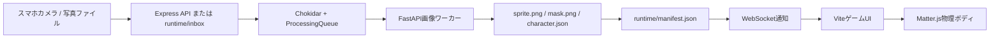

# ヒューマンタワーバトル開発記録

- 記録日: 2026-07-16
- 対象プロジェクト: Human Stack Battle / ヒューマンタワーバトル
- 作業ディレクトリ: `D:\開発\動物タワーバトル`
- 公開確認時URL: `https://updates-maria-regard-grande.trycloudflare.com`

> 公開確認時URLはCloudflare Quick Tunnelで発行した一時URLであり、トンネルの停止や再作成で変わる可能性がある。恒久公開にはNamed Tunnelと専用ホスト名を使用する。

## 1. この記録の目的

このプロジェクトでは、写真から人物を切り抜いて物理ゲームのキャラクターに変換するところから、スマートフォン向けUI、カメラ撮影、Cloudflare経由の公開までを短い反復で実装した。

本書は次の情報を一か所に残すための記録である。

- 要件がどのような順番で変化したか
- 各問題に対して採用した実装手法と判断理由
- 写真がゲームキャラクターになるまでの処理
- スマートフォンで遊べる画面にするための知見
- Cloudflareで既存ホームページと衝突させず公開した方法
- 検証内容、未解決のリスク、次回の改善候補

## 2. 最終的にできたもの

- Matter.jsを使った人物タワー積み上げゲーム
- ディレクトリ投入またはスマホカメラ撮影からのキャラクター登録
- `rembg`を優先使用する人物切り抜き
- アルファマスクから生成するキャラクター固有の当たり判定
- 新規キャラクターのWebSocketによる自動反映
- キャラクターごとの有効・無効設定
- 落下後の移動・回転禁止
- 画面左右・下への落下を検出するゲームオーバー判定
- スマートフォンに収まるプレイ領域、HUD、親指操作バー
- 日本語化した画面と、処理に約10秒かかる旨の進捗表示
- 縦長カメラ、映像上の半透明撮影ボタン、内外カメラ切り替え
- Apple系の半透明マテリアルを参考にしたUI
- 専用ローカルポートとCloudflare Tunnelによる外部公開

## 3. 要件と実装の変遷

| 段階 | 要望・発見 | 対応と判断 |
| --- | --- | --- |
| 1 | 開発再開とオンボーディング | Node.js、Python、ゲーム、API、画像ワーカーの構成を確認し、既存資料と起動コマンドを整理した。 |
| 2 | ディレクトリ内の人物写真をゲームで使いたい | `runtime/inbox`をChokidarで監視し、Pythonワーカーで切り抜き、スプライト、マスク、当たり判定、メタデータを生成する流れを構築した。 |
| 3 | キャラクターを任意に出現させたい | `enabled`をマニフェストへ追加し、キャラクター画面のトグル、PATCH API、ゲーム内抽選の絞り込みを実装した。最低1体は有効に保つ。 |
| 4 | 落下速度を下げたい | 重力、初速、摩擦などを`physicsConfig`へ集約し、落下挙動を調整した。 |
| 5 | スマホで操作しやすくしたい | プレイ領域を縦画面へ最適化し、HUDを上端、操作バーを下端、開始ボタンを中央、管理機能を右上メニューへ配置した。 |
| 6 | 左右端でキャラクターが止まりゲームオーバーにならない | 壁への依存をやめ、落下済みキャラクターの境界外判定を左・右・下に追加した。下部センサーとの二重構成で判定する。 |
| 7 | 落下中に移動・回転できてしまう | `dropped`フラグを物理ボディに持たせ、操作可否をゲームロジック側で制限した。UIのボタン無効化だけには依存していない。 |
| 8 | キャラクターが大きい | 基準身長を調整し、従来のおよそ3分の2へ縮小した。横幅もプレイ領域比率で上限を設けた。 |
| 9 | 5種類のポーズ型を先に用意する案 | 撮影者を型へ合わせる案を検討したが、実際の切り抜き精度が十分高かったため見送った。固定型より、写真ごとの輪郭生成を継続した。 |
| 10 | 既存ホームページと衝突せず公開したい | 公開用オリジンを`127.0.0.1:5180`に分離し、Cloudflare Tunnelからそのポートだけを公開した。 |
| 11 | 公開版のスマホ表示で浮島が見えない | `dvh`と幅・高さ制約を見直し、狭い画面でも島、HUD、操作バーが同じ画面に残るよう調整した。 |
| 12 | 英語を日本語化し、処理待ちを知らせたい | UI文言を日本語化し、撮影後に「作成完了まで10秒ほど」と状態表示・通知を出すようにした。 |
| 13 | カメラをスマホ向け縦長にしたい | 表示枠と生成画像を9:16に統一した。横長入力は黒背景上に全体が収まるよう合成する。 |
| 14 | Apple系の爽やかで透け感のあるUIにしたい | Apple Human Interface Guidelinesを参照し、半透明マテリアル、システムカラー、44px以上の操作領域、safe area対応を採用した。 |
| 15 | カメラが拡大され、撮影ボタンまでスクロールが必要 | 強制的な解像度指定と`object-fit: cover`をやめ、`contain`で全体表示した。撮影操作をカメラ枠内の半透明バーとして重ねた。 |
| 16 | 外カメラも使いたい | `facingMode`の`user`と`environment`を切り替えるアイコンを映像右上に追加した。失敗時は元のカメラへ復帰する。 |

## 4. システム構成



### コンポーネント

| パス | 役割 |
| --- | --- |
| `apps/game` | Vite、TypeScript、Matter.js、Canvas、撮影UI |
| `apps/server` | Express API、静的ファイル配信、WebSocket、監視・処理キュー |
| `services/image-worker` | FastAPI、人物切り抜き、マスク・輪郭生成 |
| `runtime/inbox` | 画像処理の入力 |
| `runtime/characters/<id>` | キャラクターごとの生成物 |
| `runtime/manifest.json` | ゲームで利用するキャラクター一覧の正本 |
| `outputs` | スマホ・デスクトップ表示の確認画像と公開ログ |

## 5. 写真からキャラクターを作る手法

### 5.1 入力

入力経路は二つある。

1. `.jpg`、`.jpeg`、`.png`、`.webp`を`runtime/inbox`へ置く。
2. 撮影画面から`POST /api/photos`へ送る。

ブラウザ撮影も最終的には`runtime/inbox`へ保存されるため、その後の処理は共通である。ファイル監視は書き込み完了を待ち、短時間の重複イベントをデバウンスする。

### 5.2 検証と重複排除

- Multerでアップロードサイズを制限する。
- Sharpで画像として読めることと寸法を確認する。
- SHA-256を計算し、同一画像が既に登録されていれば重複処理を避ける。
- 失敗したファイルは`runtime/rejected`へ移動する。

### 5.3 人物切り抜き

1. EXIF Orientationを反映する。
2. 長辺を最大1200pxへ縮小する。
3. `rembg`と`birefnet-portrait`で背景を除去する。
4. 透明領域をトリミングし、余白を加える。
5. 長辺620pxへ縮小する。
6. 白い縁と影を加え、ゲーム画面で見分けやすいスプライトにする。

`rembg`やネイティブ依存が利用できない場合は簡易マスクへフォールバックし、システム全体を停止させない。ただし公開品質では`rembg`が正常に動いていることを確認する。

### 5.4 当たり判定

- スプライトのアルファ値が24を超える領域を人物領域として扱う。
- OpenCVで最大輪郭を取り、その凸包を生成する。
- 周長に対して2.5%の許容値で輪郭を簡略化する。
- 最大8頂点へ削減し、画像中心を原点とする正規化座標で保存する。
- OpenCVが使えない場合や輪郭が不十分な場合は四角形へフォールバックする。

この方式により、事前定義した5種類の型へ人物を合わせる工程を不要にできた。高精度な切り抜き結果から毎回当たり判定を作る方が、撮影者の負担と運用手順を減らせた。

### 5.5 ゲームへの反映

- Pythonワーカーが`character.json`を返す。
- Node.js側が`runtime/manifest.json`を一時ファイル経由で原子的に更新する。
- WebSocketで`character.added`を通知する。
- ブラウザが一覧を再取得し、次の抽選から使用できるようにする。

## 6. ゲーム実装で得た知見

### 6.1 物理パラメータを集約する

重力、落下初速、摩擦、密度、キャラクター基準身長、待機時間などは`apps/game/src/config/physics.ts`へ集約した。体感調整を複数ファイルへ散らさないことで、スマホ実機を見ながら短時間で反復できる。

現在の主な値は次の通り。

- 重力: `0.72`
- 落下初速: `0.35`
- キャラクター基準身長: `79px`
- キャラクター最大幅: ワールド幅の`42%`
- 落下判定の接触継続時間: `240ms`
- 1ゲーム: `60秒`

### 6.2 操作禁止はゲーム状態で保証する

落下ボタンを押した時点で物理ボディへ`dropped: true`を設定する。移動・回転・再落下は`canControlActiveBody()`を通過した場合だけ実行する。画面上のボタンを無効化するだけでは、キーボード操作や将来の別入力経路を防げないためである。

### 6.3 画面外落下を座標でも監視する

下部のセンサーだけでは、左右端の形状や接触状況によってゲームオーバーを取りこぼす場合があった。そこで落下済みキャラクターについて、次の条件も毎回確認する。

- 右端が左境界より外へ出た
- 左端が右境界より外へ出た
- 上端が下境界より外へ出た

センサー接触と境界外判定の両方を持つことで、物理エンジン上の接触だけに依存しないゲームオーバー判定になった。

### 6.4 キャラクター選択はデータとして保持する

キャラクターの有効・無効は画面内だけの状態ではなく、`runtime/manifest.json`へ保存する。API側では最後の1体を無効にする操作を拒否し、ゲームの抽選対象が空になることを防ぐ。

## 7. スマートフォンUIとカメラの知見

### 7.1 ゲーム画面

- HUDはゲーム領域上端へ統合する。
- 操作バーはゲーム領域下端へ置き、左右移動・回転・落下を親指で押せる順に並べる。
- ゲーム開始前だけ中央に開始ボタンを表示する。
- リセット、撮影、キャラクター管理は右上のハンバーガーメニューへまとめる。
- `100vh`だけでなく`100dvh`とsafe areaを使い、モバイルブラウザのアドレスバー変動を考慮する。
- 狭い画面では幅だけでなく利用可能な高さからプレイ領域を算出する。

確認した代表ビューポートは`320x568`、`390x844`、`1440x900`である。

### 7.2 Apple系デザイン

Appleの画面を表面的にコピーするのではなく、次の原則へ変換した。

- ゲームを主役にし、操作UIは半透明にする。
- 青を主操作、緑を有効・成功、橙を処理中、赤を破壊的操作・失敗に使う。
- アイコンボタンを含むタッチ領域を44px以上にする。
- 半透明が利用できない環境には高不透明度の背景を用意する。
- 色だけで状態を伝えず、日本語テキストも表示する。

詳細は`docs/APPLE_DESIGN_GUIDE.md`を参照する。

### 7.3 カメラ拡大問題の原因と対策

縦長枠へ横長カメラ映像を`object-fit: cover`で入れると、中央以外が切り落とされ、利用者には大幅なズームに見える。また理想解像度を細かく指定すると、端末側がデジタルクロップする場合がある。

採用した対策は次の通り。

- `getUserMedia`ではカメラ方向だけを指定し、解像度を強制しない。
- プレビューは`object-fit: contain`で映像全体を見せる。
- 登録画像も675x1200の9:16キャンバスへ`contain`相当で合成する。
- 余白は暗色で埋め、人物を切らないことを優先する。

### 7.4 撮影操作の配置

撮影ボタンをカメラの外へ置くと、短い画面では映像とボタンを同時に見られない。そこでカメラ枠を`position: relative`とし、半透明の操作バーを下部へ絶対配置した。これによりポーズを確認したまま撮影できる。

カメラ枠の幅は、狭い画面では次の考え方で制限する。

```css
width: min(100%, 360px, calc((100dvh - 76px) * 9 / 16));
```

### 7.5 内カメラと外カメラ

- 初期値は`facingMode: user`。
- 右上の切り替えボタンで`environment`へ変更する。
- 切り替え前のMediaStreamトラックは停止する。
- 新しいカメラ取得に失敗した場合は以前の方向で再取得する。
- 撮影画面から離れた時は全トラックを停止し、端末のカメラを解放する。

実カメラの構成や`facingMode`対応は端末・ブラウザに依存する。iPhone SafariとAndroid Chromeの両方で実機確認するのが望ましい。

## 8. Cloudflareで公開した方法

### 8.1 ポート分離

| 用途 | アドレス |
| --- | --- |
| 開発用Vite | `127.0.0.1:5173` |
| 開発用Express | `127.0.0.1:5174` |
| Python画像ワーカー | `127.0.0.1:8788` |
| 公開用Expressオリジン | `127.0.0.1:5180` |

公開用Expressはビルド済みゲーム、API、WebSocket、キャラクター画像を同じオリジンで配信する。既存ホームページが使うポートとは別に`5180`を割り当て、Cloudflare Tunnelの転送先もこのポートだけにした。

### 8.2 公開用設定

`.env.public`の主要設定は次の構成である。

```dotenv
HOST=127.0.0.1
PORT=5180
SERVE_GAME=true
GAME_DIST_DIR=apps/game/dist
GAME_ORIGIN=http://127.0.0.1:5180
PYTHON_WORKER_URL=http://127.0.0.1:8788
```

`HOST=127.0.0.1`のままにし、ローカルネットワークへ直接公開せず、Cloudflare Tunnelだけを入口にする。

### 8.3 起動手順

公開スタックを起動する。

```powershell
npm run public
```

このコマンドは型チェックとViteビルドを行い、その後ExpressとPythonワーカーを起動する。

別のPowerShellでQuick Tunnelを起動する。

```powershell
& "$env:LOCALAPPDATA\cloudflared\cloudflared.exe" tunnel --url http://127.0.0.1:5180
```

今回の確認ではCloudflareの大阪接続点へQUICで接続され、`trycloudflare.com`のURLからHTTP 200、最新CSS、最新JavaScriptの配信を確認した。

### 8.4 なぜ既存ホームページと衝突しないか

- ローカルの転送先ポートが専用の`5180`である。
- Quick Tunnelが発行するホスト名は既存ホームページと別である。
- 公開用サーバーがゲームの静的ファイルとAPIを同一オリジンで扱うため、既存サイトのルーティングを変更していない。

### 8.5 恒久公開へ進める場合

Quick Tunnelはプレビュー用途であり、プロセス停止で利用できなくなる。恒久公開では次を行う。

1. Named Tunnelを作成する。
2. `game.example.com`のような専用サブドメインを割り当てる。
3. ingressを`http://127.0.0.1:5180`へ向ける。
4. Express、Pythonワーカー、cloudflaredをWindowsサービスまたは監視付きプロセスとして常駐させる。
5. Access、認証、アップロード制限、ログ監視、バックアップ方針を追加する。

## 9. 検証方法と記録

### 自動検証

```powershell
npm run test
npm run build
```

最終確認時は4テストファイル、9テストが成功し、TypeScript型チェックとVite本番ビルドも成功した。

主な自動テスト対象は次の通り。

- 左右・下の境界外落下判定
- ターン管理
- マニフェスト生成、重複排除、原子的書き込み
- 旧データの`enabled`既定値と更新

### ブラウザ検証

- `320x568`と`390x844`でゲーム・撮影画面を確認
- `1440x900`でデスクトップ表示を確認
- HUD、浮島、操作バー、開始ボタンが画面内に収まることを確認
- 撮影ボタンがカメラ映像上にあり、スクロール不要であることを確認
- カメラ切り替えボタンと撮影操作が重ならないことを確認
- 横スクロールが発生しないことを確認
- ブラウザコンソールにエラーがないことを確認
- 公開URLが最新のハッシュ付きCSS・JavaScriptを返すことを確認

確認画像は`outputs`に保存されている。特に次のファイルが比較に使いやすい。

- `outputs/apple-game-final-320x568.png`
- `outputs/apple-game-390x844.png`
- `outputs/apple-capture-390x844.png`
- `outputs/capture-overlay-320x568.png`
- `outputs/capture-overlay-390x844.png`

### 検証上の限界

- `tests/e2e.spec.ts`は現時点ではサービス構成の簡易契約テストであり、実ブラウザ操作を通す完全なE2Eテストではない。
- カメラ権限の許可と実際の内外カメラ切り替えは端末依存であり、自動ブラウザ確認では実行していない。
- 画像処理時間は端末性能、モデル初回ロード、画像サイズで変動するため、「10秒」は利用者向けの目安である。

## 10. 運用手順

### 初回セットアップ

```powershell
npm install
npm run setup:python
```

### 開発再開

```powershell
npm run dev
```

- ゲーム: `http://127.0.0.1:5173`
- API: `http://127.0.0.1:5174`
- 画像ワーカー: `http://127.0.0.1:8788`

### 写真を直接追加

1. 対応画像を`runtime/inbox`へ置く。
2. `runtime/characters/<id>`に生成物ができることを確認する。
3. `runtime/manifest.json`にキャラクターが追加されることを確認する。
4. 起動中のゲームへ自動反映されることを確認する。

### 公開前確認

```powershell
npm run test
npm run build
```

次に`npm run public`とCloudflare Tunnelを起動し、公開URLでスマホ表示、撮影画面、APIヘルスを確認する。

## 11. 今後の重要課題

優先度が高い順に記録する。

1. **公開APIの保護**: 現在は写真アップロード、キャラクター更新・削除APIに利用者認証がない。Quick Tunnelでの限定確認には使えるが、不特定多数向け恒久公開の前にCloudflare Access、アプリ認証、操作権限、レート制限が必要。
2. **恒久トンネル**: Named Tunnelと専用サブドメインへ移行し、再起動後もURLが変わらない構成にする。
3. **プロセス常駐化**: Express、FastAPI、cloudflaredの自動起動、異常終了時再起動、ログローテーションを用意する。
4. **実機E2E**: iPhone SafariとAndroid Chromeでカメラ権限、内外切り替え、撮影、約10秒後の追加まで確認する。
5. **ブラウザE2E自動化**: MediaStreamと画像ワーカーをテスト用に差し替え、撮影からWebSocket反映までを自動化する。
6. **データ保持方針**: 元写真、切り抜き、マスクの保存期間と削除機能を決める。公開イベント用途では本人同意も必要。
7. **監視とバックアップ**: `/api/health`、画像ワーカー、処理失敗数、`runtime/manifest.json`と生成画像のバックアップを監視対象にする。

## 12. 今回の開発から得た原則

1. スマホUIは幅だけでなく「短い高さ」で必ず検証する。
2. カメラプレビューと撮影操作は同じコンテナ内に置き、同時に見えることを保証する。
3. 人物を切らない用途では`cover`より`contain`を優先する。
4. 操作禁止はUIではなくゲーム状態とドメインロジックで保証する。
5. 物理ゲームの敗北判定は接触イベントだけでなく座標境界でも補強する。
6. 画像処理は一つの入力キューへ集約し、フォルダ投入とカメラ撮影で同じ処理を使う。
7. 生成データの正本を一つにし、原子的に更新する。
8. 高精度な自動処理が得られた場合は、利用者へ姿勢を強制する追加工程を増やさない。
9. Quick Tunnelは確認を速くする手段、Named Tunnelは運用を安定させる手段として使い分ける。
10. 「動く」だけでなく、処理中・失敗・復帰を画面上で利用者へ伝える。

## 関連資料

- `README.md`: セットアップと基本操作
- `docs/ARCHITECTURE.md`: コンポーネントとデータ契約
- `docs/REQUIREMENTS.md`: MVP要件
- `docs/IMPLEMENTATION_PLAN.md`: 実装フェーズ
- `docs/APPLE_DESIGN_GUIDE.md`: Apple系UIへ適用した設計原則

## 13. Cloudflare Pagesへのゲーム本体分離（2026-07-16）

### 採用した構成

- ゲーム本体、既存キャラクター画像、当たり判定データはCloudflare Pagesから配信する。
- PC上のExpress、Python画像ワーカー、Cloudflare Tunnelは撮影・切り抜き・新規登録だけを担当する。
- PC側APIへ接続できない場合は、Pages内の`/data/characters.json`へ自動的に切り替える。
- オフライン時のキャラクター有効・無効設定はブラウザの`localStorage`へ保存する。
- 最後の有効キャラクターは無効化できない制約を、オンライン・オフライン双方で維持する。

### 静的キャラクターの同期

`scripts/sync-static-characters.mjs`が`runtime/manifest.json`を読み、ゲームで必要なメタデータと`sprite.png`だけを`apps/game/public`へ生成する。元写真とマスクはPagesへ含めない。

```powershell
npm run build:pages
npm run deploy:pages
```

公開先は`https://human-stack-battle-game.pages.dev`。Pagesプロジェクト名は`human-stack-battle-game`。

### PC停止時の挙動

- ゲーム開始、移動、回転、落下、当たり判定、ゲームオーバー、キャラクター選択は利用できる。
- 撮影画面は表示できるが、カメラ起動・切替・登録・名前入力は無効になる。
- 画面には「PC側の画像処理は現在停止中です。ゲームはそのまま遊べます。」と表示する。
- PC側サービスが復旧して再読込すると、撮影機能とWebSocket更新が再び有効になる。

### 検証結果

- Vitest: 5ファイル、11テスト成功。
- Pages用TypeScriptチェックとViteビルド成功。
- `390x844`のスマホ表示で、HUD、浮島、キャラクター、親指操作バーが同一画面に収まることを確認。
- PC側の5180番・8788番ポートを停止した状態で、Pagesの静的6キャラクターを使ってゲーム開始できることを確認。
- 停止中は撮影機能だけが無効になることを確認。
- PC側サービス再起動後、Quick TunnelのAPIがHTTP 200へ戻り、撮影操作と「作成完了まで10秒ほど」の案内が復旧することを確認。

### 運用上の注意

現在の画像処理APIはQuick Tunnelを使っているため、`cloudflared`再起動後にURLが変わる可能性がある。URLが変わった場合は`apps/game/.env.pages`の`VITE_API_BASE_URL`を更新して再デプロイする。イベント運用を安定させる段階ではNamed Tunnelと専用サブドメインへ移行する。
