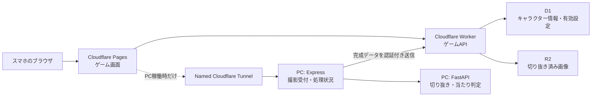

# 固定URL・常時稼働化 移行計画

作成日: 2026-07-16

## 1. 目的

ゲーム本体はPCの電源状態に依存せず、固定URLで常時プレイできるようにする。
撮影と画像加工だけはPC上で実行し、PCが起動して処理サービスが動いている間だけ利用可能にする。

## 2. 目標URL

既存ホームページと衝突しない専用サブドメインを使う。実ドメイン決定までは次を仮名とする。

| 役割 | 固定URL例 | 稼働条件 |
| --- | --- | --- |
| ゲーム画面 | `https://game.example.com` | 常時稼働 |
| ゲームAPI | `https://game-api.example.com` | 常時稼働 |
| 撮影・画像加工API | `https://capture.game.example.com` | PC起動時のみ |

`human-stack-battle-game.pages.dev`は、カスタムドメイン障害時の予備URLとして残す。

## 3. 採用構成



### 常時稼働側

- Cloudflare Pages: Viteゲーム画面を配信する。
- Cloudflare Worker: キャラクター一覧、有効・無効更新、画像取得、PCからの完成データ登録を担当する。
- D1: キャラクター名、サイズ、当たり判定頂点、有効状態、作成日時、R2キーを保存する。
- R2: `sprite.png`だけを保存する。元写真とマスクは保存しない。

### PC側

- Express: 写真アップロード、処理状況、WebSocket通知を担当する。
- FastAPI: 人物切り抜き、画像整形、当たり判定生成を担当する。
- Named Cloudflare Tunnel: `capture.game.example.com`を`127.0.0.1:5180`へ固定接続する。
- 処理完了後、ExpressがWorkerの内部登録APIへ画像とメタデータを送る。

## 4. 責務の変更

### Cloudflare Workerへ移すAPI

- `GET /api/health`
- `GET /api/characters`
- `GET /api/characters/:id`
- `PATCH /api/characters/:id`
- `GET /characters/:id/sprite.png`
- `POST /internal/characters`（PC専用、認証必須）
- `DELETE /internal/characters/:id`（管理用、認証必須）

### PC側に残すAPI

- `GET /api/health`
- `POST /api/photos`
- `GET /api/processing`
- `/ws`

PC側からはキャラクター一覧、画像配信、有効・無効更新を外す。移行期間中だけ互換用として残し、切替完了後に削除する。

## 5. データ設計

### D1テーブル案

```sql
CREATE TABLE characters (
  id TEXT PRIMARY KEY,
  name TEXT NOT NULL,
  enabled INTEGER NOT NULL DEFAULT 1,
  sprite_key TEXT NOT NULL UNIQUE,
  width INTEGER NOT NULL,
  height INTEGER NOT NULL,
  collision_mode TEXT NOT NULL,
  vertices_json TEXT NOT NULL,
  source_hash TEXT UNIQUE,
  created_at TEXT NOT NULL,
  updated_at TEXT NOT NULL
);
```

有効キャラクターを最低1体残す制約はWorkerのトランザクション内で確認する。

### R2キー案

```text
characters/<character-id>/sprite.png
```

ブラウザへはWorker経由で配信し、`content-type`、ETag、キャッシュ制御を設定する。

## 6. フロントエンド変更

現在の`VITE_API_BASE_URL`を次の2つへ分離する。

```dotenv
VITE_GAME_API_BASE_URL=https://game-api.example.com
VITE_CAPTURE_API_BASE_URL=https://capture.game.example.com
```

### 読み込みルール

1. キャラクター一覧と画像は常にゲームAPIから取得する。
2. ゲームAPI障害時だけPages内の静的6キャラクターへフォールバックする。
3. 撮影画面を開くときだけ撮影APIの`/api/health`を短いタイムアウトで確認する。
4. 撮影APIが停止中なら、ゲームには影響させず撮影操作だけを無効にする。
5. 撮影完了通知後はゲームAPIからキャラクター一覧を再取得する。

`CharacterRepository`の`remoteAvailable`は「ゲームAPI」と「撮影API」の2状態へ分離する。現在のように撮影API停止がキャラクター設定のローカル保存へ影響しない構造にする。

## 7. Named Tunnel

Quick Tunnelを廃止し、Cloudflareアカウントに`human-stack-capture`というNamed Tunnelを作る。

```yaml
tunnel: <TUNNEL_UUID>
credentials-file: %USERPROFILE%\.cloudflared\<TUNNEL_UUID>.json
ingress:
  - hostname: capture.game.example.com
    service: http://127.0.0.1:5180
  - service: http_status:404
```

PC停止中もDNS名は変わらない。接続先が停止している場合はCloudflare側のエラーになるため、フロントではタイムアウトまたは非200を「撮影停止中」として扱う。

Windows起動時の自動常駐は後から選択できるようにし、最初は次の明示的な運用にする。

```powershell
npm run capture:start
npm run capture:stop
npm run capture:status
```

起動スクリプトはExpress、FastAPI、`cloudflared`、外部ヘルスチェックをまとめて扱う。停止スクリプトは3プロセスを終了し、5180番・8788番ポートが閉じたことまで確認する。

## 8. セキュリティ

### 一般利用者の撮影

- `POST /api/photos`はTurnstileを付け、PC側でSiteverifyを実行する。
- MIMEタイプ、実画像デコード、最大容量、最大解像度を検査する。
- IP単位のレート制限と同時処理数制限を設ける。
- CORSはゲームの本番URLとPages予備URLだけを許可する。
- 元写真はイベント運用方針に従って処理後に削除できるようにする。

### PCからWorkerへの登録

- `POST /internal/characters`は公開ユーザーから利用できないようBearerトークンまたはHMAC署名で保護する。
- トークンはWorker SecretとPCの非コミット環境変数に保存する。
- `source_hash`を一意にし、再送時に重複キャラクターを作らない。
- R2登録とD1登録の途中失敗を再試行できるよう、冪等なAPIにする。

CORSは認証の代わりにならないため、内部登録・削除APIには必ず認証を入れる。

## 9. 実装フェーズ

### Phase 0: 決定事項

- 実際に使用するドメイン名を決める。
- キャラクター有効・無効を全利用者共通にするか、端末ごとにするか決める。
- 元写真の保存期間を決める。

完了条件: URL、データ保持、管理権限が文書で確定している。

### Phase 1: 常時稼働ゲームAPI

- `apps/cloud-api`へWorkerプロジェクトを追加する。
- `wrangler.jsonc`、D1マイグレーション、R2バインディングを作る。
- キャラクター取得・有効更新・画像配信APIを実装する。
- Workerの固定URLまたはカスタムドメインでテストする。

完了条件: PC停止中でもゲームAPIからキャラクター一覧と画像を取得できる。

### Phase 2: 既存6体の移行

- `runtime/manifest.json`からD1投入用データを生成する。
- 6体の`sprite.png`をR2へアップロードする。
- 件数、ハッシュ、画像寸法、当たり判定頂点を照合する。

完了条件: D1件数とR2画像数が一致し、全キャラをゲームで表示できる。

### Phase 3: フロントエンド分離

- ゲームAPIと撮影APIのURL設定を分離する。
- キャラクター管理をWorker APIへ接続する。
- 撮影API停止中の表示と再接続処理を実装する。
- Pagesへデプロイし、`game.example.com`を関連付ける。

完了条件: PC停止中でもゲームとキャラクター管理が動き、撮影だけ停止表示になる。

### Phase 4: PC処理結果のクラウド登録

- ExpressにWorker登録クライアントを追加する。
- 完成した`sprite.png`とメタデータを内部APIへ送る。
- 再送、重複防止、失敗キューを実装する。
- 登録成功後にブラウザへ完了通知する。

完了条件: 撮影した新キャラがR2/D1へ保存され、PC停止後もゲームで使える。

### Phase 5: Named Tunnelと運用スクリプト

- Named Tunnelと`capture.game.example.com`を作成する。
- 起動・停止・状態確認スクリプトを追加する。
- Quick Tunnel依存と毎回のPages再デプロイを削除する。

完了条件: PC再起動後も同じ撮影URLを使用できる。

### Phase 6: 保護と総合試験

- Turnstile、レート制限、アップロード検証、内部API認証を追加する。
- PCオン・オフ、Tunnel停止、画像ワーカー停止、Worker障害を試験する。
- iPhone SafariとAndroid Chromeで撮影からゲーム反映まで確認する。

完了条件: 下記の受け入れ条件をすべて満たす。

## 10. 受け入れ条件

### PCオフ

- `game.example.com`が表示できる。
- ゲーム開始、移動、回転、落下、当たり判定、ゲームオーバーが動く。
- キャラクター一覧、画像、有効・無効設定が動く。
- 撮影画面は2秒程度で停止状態を表示する。
- 既存キャラと過去に撮影したキャラを利用できる。

### PCオン

- `capture.game.example.com/api/health`が200を返す。
- 内カメラ・外カメラを切り替えられる。
- 写真送信、切り抜き、当たり判定生成、登録が完了する。
- 完成キャラがゲームへ反映される。
- PCを停止した後も、そのキャラをゲームで利用できる。

### 障害時

- 撮影API停止がゲーム本体へ波及しない。
- ゲームAPI障害時はPages同梱キャラへフォールバックする。
- 登録途中の失敗は再送でき、重複登録されない。

## 11. 切替とロールバック

1. 現在のPages URLと静的6キャラを残したままWorker APIを追加する。
2. 本番フロントを環境変数で新APIへ切り替える。
3. PCオン・オフ試験が通るまでQuick Tunnel構成を削除しない。
4. 問題があればPagesを直前のデプロイへ戻し、静的キャラ運用へ戻す。
5. 安定確認後にQuick Tunnel用設定を削除する。

ホームページ側のDNSレコードや公開設定は変更せず、新規サブドメインだけを追加する。

## 12. 実装順の推奨

最初にPhase 1からPhase 3を実施し、「PCオフでもゲーム本体が完全に動く」状態を完成させる。次にPhase 4とPhase 5で撮影結果の永続化と固定Tunnelを追加する。最後にPhase 6で公開アップロードの保護を入れる。

この順番なら各段階で既存のPages版へ戻せるため、イベント直前でもゲーム本体を止めずに移行できる。

## 13. 参考資料

- [Cloudflare Pages custom domains](https://developers.cloudflare.com/pages/configuration/custom-domains/)
- [Cloudflare Workers custom domains](https://developers.cloudflare.com/workers/configuration/routing/custom-domains/)
- [Cloudflare Tunnel published applications](https://developers.cloudflare.com/cloudflare-one/networks/connectors/cloudflare-tunnel/routing-to-tunnel/)
- [Run cloudflared as a Windows service](https://developers.cloudflare.com/tunnel/advanced/local-management/as-a-service/windows/)
- [Cloudflare D1 Workers Binding API](https://developers.cloudflare.com/d1/worker-api/)
- [Cloudflare R2 Workers API](https://developers.cloudflare.com/r2/get-started/workers-api/)
- [Cloudflare Turnstile server-side validation](https://developers.cloudflare.com/turnstile/get-started/server-side-validation/)
- [Cloudflare Workers secrets](https://developers.cloudflare.com/workers/configuration/secrets/)
